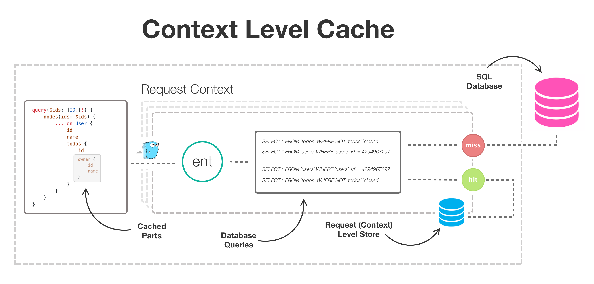

# entcache

An experimental cache driver for [ent](https://github.com/ent/ent) with variety of stores,
such as context-based (i.e. request-based ) level, driver (or process) level, remote level
and multi level.

## Quick Introduction

First, `go get` the package using thw following command.

```shell
go get ariga.io/entcache
```

TODO (choose store and configure the ent client).

## Design

TODO (entcache basics and levels concepts)

### Caching Levels

`entcache` provides several builtin cache levels.

1\. A `context.Context`-based level. Usually, attached to a request and does not work with other cache levels.
It is used to eliminate duplicate queries that are executed by the same request.

2\. A driver-based level used by the `ent.Client`. An application usually creates a driver per database,
and therefore, we treat it as a process-level cache.

3\. A remote-based level. For example, a Redis database that provides a persistence layer for storing and sharing cache
  entries between multiple processes. A remote cache layer is resistant to application deployment changes or failures,
  and allows reducing the number of identical queries executed on the database by different applications.

4\. A cache hierarchy, or multi-level cache allows structuring the cache in hierarchical way. The hierarchy of cache
stores is mostly based on access speeds and cache sizes. For example, a 2-level cache that compound from an LRU-cache
in the application memory, and a remote-level cache backed by a Redis database.

#### Context Level Cache

The `ContextLevel` option configures the driver to work with a `context.Context` level cache. The context is usually
attached to a request (e.g. `*http.Request`) and does not work with other cache levels. When this option is used as
a cache store, the attached `context.Context` carries an LRU cache (can be configured differently), and the driver
stores and searches entries in the LRU cache when queries are executed.

This option is ideal for applications that require strong consistency, but still want to avoid executing duplicate
database queries on the same request. For example, given the following GraphQL query:

```graphql
query($ids: [ID!]!) {
    nodes(ids: $ids) {
        ... on User {
            id
            name
            todos {
                id
                owner {
                    id
                    name
                }
            }
        }
    }
}
```

A naive solution for resolving the above query will execute, 1 for getting N users, another N queries for getting
the todos of each user, and a query for each todo item for getting its owner (read more about the
[_N+1 Problem_](https://entgo.io/docs/tutorial-todo-gql-field-collection/#problem)).

However, Ent provides a unique approach for resolving such queries(read more in
[Ent website](https://entgo.io/docs/tutorial-todo-gql-field-collection)) and therefore, only 3 queries will be executed
in such case. 1 for getting N users, 1 for getting the todo items of **all** users, and 1 query for getting the owners
of **all** todo items.

With `entcache`, the number of queries may be reduced to 2, as the first and last queries are identical (see
[code example](internal/examples/ctxlevel/main_test.go)).



##### Usage In GraphQL

In order to instantiate an `entcache.Driver` in a `ContextLevel` mode and use it in the generated `ent.Client` use the
following configuration.

```go
// An SQLite exmaple.
db, err := sql.Open(dialect.SQLite, "file:ent?mode=memory&cache=shared&_fk=1")
if err != nil {
	log.Fatal("opening database", err)
}
drv := entcache.NewDriver(db, entcache.ContextLevel())
client := ent.NewClient(ent.Driver(drv))
```

Then, when a GraphQL query hits the server, we wrap the request `context.Context` with an `entcache.NewContext`.

```go
srv.AroundResponses(func(ctx context.Context, next graphql.ResponseHandler) *graphql.Response {
	if op := graphql.GetOperationContext(ctx).Operation; op != nil && op.Operation == ast.Query {
		ctx = entcache.NewContext(ctx)
	}
	return next(ctx)
})
```

That's it! Your server is ready to use `entcache` with GraphQL, and a full server example exits in
[examples/ctxlevel](internal/examples/ctxlevel).

##### Middleware Example

An example of using the common middleware pattern in Go for wrapping the request `context.Context` with
an `entcache.NewContext` in case of `GET` requests.

```go
srv.Use(func(next http.Handler) http.Handler {
	return http.HandlerFunc(func(w http.ResponseWriter, r *http.Request) {
		if r.Method == http.MethodGet {
			r = r.WithContext(entcache.NewContext(r.Context()))
		}
		next.ServeHTTP(w, r)
	})
})
```

#### Driver Level Cache

TODO

#### Remote Level Cache

TODO

#### Multi Level Cache

TODO

### Implementation

TODO (driver decorator pattern and Rows recorder implementation)

### Future Work

TODO (smart eviction mechanism based on SQL parsing and additional remote levels like Memcache)
